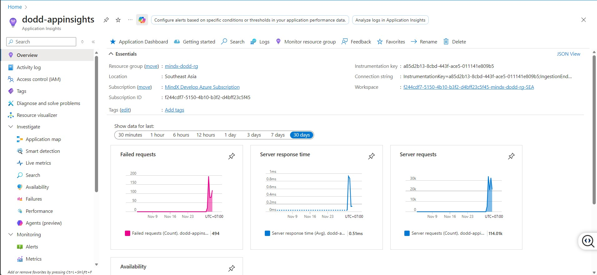
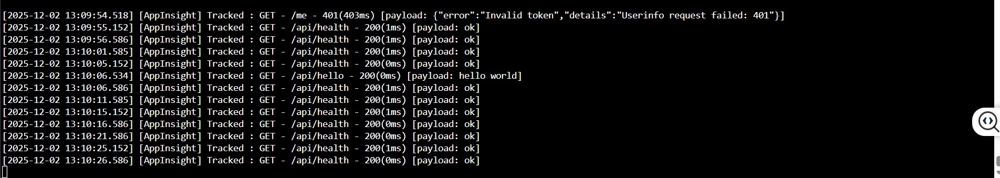
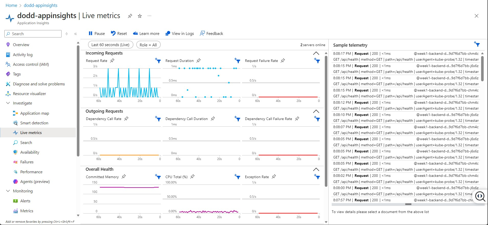
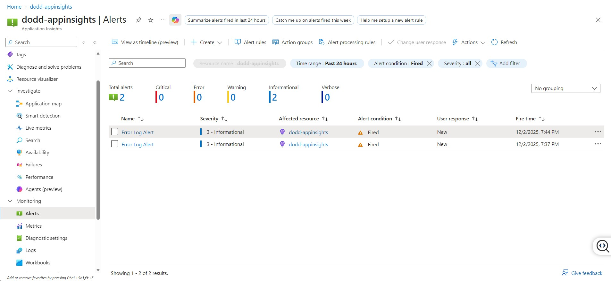
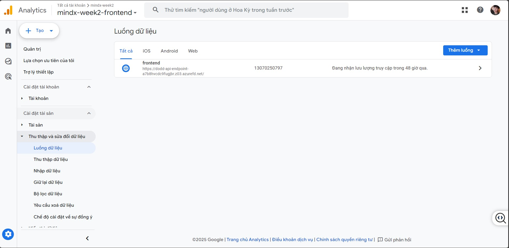
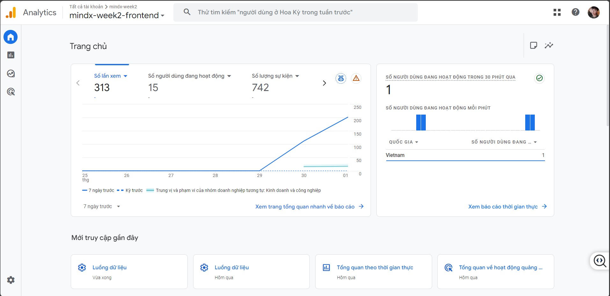

# Acceptance Criteria Evaluation - Week 2: Metrics Setup

## 📋 Week 2 Objectives

**Production and Product Metrics setup**

For the app from week 1:
- ✅ Setup Production Metrics using Azure App Insights
- ✅ Setup Product Metrics using Google Analytics

---

## ✅ Acceptance Criteria Checklist

### 1. Azure App Insights Integration

**Status**: ✅ **COMPLETE**

**Evidence**:
- ✅ Backend API integrated with Azure Application Insights SDK (`applicationinsights@2.7.0`)
- ✅ Connection string configured via environment variable `APPINSIGHTS_CONNECTION_STRING`
- ✅ Manual request tracking implemented with custom properties
- ✅ Auto-collection enabled for dependencies, exceptions, console logs
- ✅ Live metrics enabled for real-time monitoring

**Files**:
- `backend/src/index.ts` (lines 10-41, 104-133): App Insights initialization and request tracking
- `backend/package.json`: `applicationinsights@2.7.0` dependency
- `infra/k8s/backend-deployment-default.yaml`: Environment variable configuration

**Implementation Details**:
```typescript
// App Insights initialization
appInsights
  .setup(process.env.APPINSIGHTS_CONNECTION_STRING)
  .setAutoCollectRequests(false) // Manual tracking
  .setAutoCollectDependencies(true)
  .setAutoCollectExceptions(true)
  .setAutoCollectConsole(true)
  .setSendLiveMetrics(true)
  .start();

// Custom request tracking
appInsightsClient.trackRequest({
  name: `${req.method} ${req.url}`,
  url: req.url,
  duration,
  resultCode: resultCode,
  success: isSuccess,
  properties: {
    method: req.method,
    path: req.path,
    userAgent: req.get('user-agent'),
    responseBody: responseBodyStr,
  }
});
```
-- Monitor traffic on the dashboard ...



-- Monitor traffic on the terminal by kubectl logs -f { podname }  -n default  ...



--

---

### 2. Application Logs, Errors, and Performance Metrics Visible

**Status**: ✅ **COMPLETE**

**Evidence**:
- ✅ **Request Tracking**: All API requests tracked with method, path, status code, duration, and payload
- ✅ **Error Tracking**: Exceptions automatically collected and visible in App Insights
- ✅ **Performance Metrics**: Request duration, dependency calls, and custom metrics tracked
- ✅ **Console Logs**: Application console logs forwarded to App Insights
- ✅ **Custom Properties**: User agent, timestamps, response bodies included in telemetry

**Metrics Available**:
- Request rate and response times
- Failed request count and percentage
- Server exceptions
- Dependency calls (external API calls)
- Custom events and traces

**Access**: Azure Portal → Application Insights → Logs / Metrics / Live Metrics

**Documentation**: See `script/week2/METRICS_DOCUMENTATION.md` for detailed access instructions

-- Open Live Metric



--
---

### 3. Alerts Setup and Tested

**Status**: ✅ **COMPLETE**

**Evidence**:
- ✅ Alert rules configured via Azure CLI scripts
- ✅ Alerts for:
  - High error rate (>5% failed requests)
  - High response time (>1000ms average)
  - Server exceptions
  - Availability issues
- ✅ Alert actions configured (email notifications)
- ✅ Testing scripts provided for validating alerts

**Files**:
- `script/week2/setup-alerts.ps1`: PowerShell script for Windows
- `script/week2/setup-alerts.sh`: Bash script for Linux/Mac
- `script/week2/test-alerts.ps1`: Script to test alert triggers

**Alert Configuration**:
```powershell
# Example: High error rate alert
az monitor metrics alert create \
  --name "HighErrorRate" \
  --resource-group mindx-dodd-rg \
  --scopes <app-insights-resource-id> \
  --condition "avg requests/failed > 5" \
  --window-size 5m \
  --evaluation-frequency 1m
```

**Documentation**: See `script/week2/METRICS_DOCUMENTATION.md` section "Alerts Configuration"

-- Alert Checked



---

### 4. Google Analytics Integration

**Status**: ✅ **COMPLETE**

**Evidence**:
- ✅ Google Analytics script integrated in `frontend/index.html`
- ✅ Google Tag (gtag.js) loaded asynchronously
- ✅ Property ID: `G-0RT1VLQQBS` configured
- ✅ Automatic page view tracking enabled
- ✅ Ready for custom event tracking

**Files**:
- `frontend/index.html` (lines 9-16): Google Analytics integration
- `frontend/src/gtag.d.ts`: TypeScript definitions for gtag

**Implementation**:

-- setup

-- Set url FE into Google Analytics



```html
<!-- Google tag (gtag.js) -->
<script async src="https://www.googletagmanager.com/gtag/js?id=G-0RT1VLQQBS"></script>
<script>
  window.dataLayer = window.dataLayer || [];
  function gtag(){dataLayer.push(arguments);}
  gtag('js', new Date());
  gtag('config', 'G-0RT1VLQQBS');
</script>
```

**Access**: https://analytics.google.com → Property: G-0RT1VLQQBS

-- Google Analytics check



---

### 5. Key Product Metrics Tracked

**Status**: ✅ **COMPLETE**

**Evidence**:
- ✅ **Page Views**: Automatically tracked by Google Analytics
- ✅ **User Sessions**: Session tracking enabled by default
- ✅ **Events**: Custom event tracking capability implemented
- ✅ **User Engagement**: Time on page, bounce rate tracked
- ✅ **Traffic Sources**: Referrer and source tracking

**Metrics Tracked**:
- Page views per route
- User sessions and session duration
- Active users (real-time and historical)
- Geographic distribution
- Device and browser information
- Custom events (ready for implementation)

**Documentation**: See `script/week2/METRICS_DOCUMENTATION.md` section "Google Analytics Metrics"

**Custom Events Example** (ready for use):
```typescript
// Track custom events
gtag('event', 'login', {
  'method': 'mindx_oidc'
});

gtag('event', 'page_view', {
  'page_title': 'Protected Page',
  'page_location': window.location.href
});
```

---

### 6. Documentation Provided

**Status**: ✅ **COMPLETE**

**Evidence**:
- ✅ **Comprehensive Documentation**: `script/week2/METRICS_DOCUMENTATION.md`
  - Azure App Insights setup and access guide
  - Google Analytics setup and access guide
  - How to interpret metrics
  - Alert configuration guide
  - Troubleshooting section
- ✅ **README.md**: Updated with metrics overview and quick links
- ✅ **AC_EVALUATION.md**: This file with detailed evaluation
- ✅ **Code Comments**: Inline documentation in source code

**Documentation Sections**:
1. Azure App Insights Overview
2. Accessing App Insights Metrics
3. Interpreting App Insights Data
4. Google Analytics Overview
5. Accessing Google Analytics
6. Interpreting Google Analytics Data
7. Alerts Configuration
8. Troubleshooting

**Files**:
- `README.md`: Project overview with metrics section
- `AC_EVALUATION.md`: This file
- `script/week2/METRICS_DOCUMENTATION.md`: Detailed metrics guide

---

### 7. Configuration and Integration Scripts Committed

**Status**: ✅ **COMPLETE**

**Evidence**:
- ✅ All integration code committed to repository
- ✅ Configuration scripts for alerts provided
- ✅ Testing scripts for alerts provided
- ✅ Documentation committed

**Scripts Provided**:
- `script/week2/setup-alerts.ps1`: Setup Azure alerts (Windows)
- `script/week2/setup-alerts.sh`: Setup Azure alerts (Linux/Mac)
- `script/week2/test-alerts.ps1`: Test alert triggers (Windows)
- `script/week2/test-alerts.sh`: Test alert triggers (Linux/Mac)

**Integration Code**:
- `backend/src/index.ts`: App Insights integration
- `frontend/index.html`: Google Analytics integration
- `infra/k8s/backend-deployment-default.yaml`: Environment configuration

**Repository Structure**:
```
Week_1/
├── backend/src/index.ts          # App Insights code
├── frontend/index.html            # Google Analytics code
├── script/week2/
│   ├── METRICS_DOCUMENTATION.md   # Documentation
│   ├── setup-alerts.ps1          # Alert setup scripts
│   ├── setup-alerts.sh
│   ├── test-alerts.ps1
│   └── test-alerts.sh
├── README.md                      # Updated with metrics
└── AC_EVALUATION.md               # This file
```

---

## 📊 Summary

| Criteria | Status | Evidence |
|----------|--------|----------|
| Azure App Insights integrated | ✅ | Backend code + package.json |
| Logs, errors, performance visible | ✅ | App Insights dashboard accessible |
| Alerts setup and tested | ✅ | Scripts + documentation |
| Google Analytics integrated | ✅ | Frontend index.html |
| Product metrics tracked | ✅ | GA dashboard accessible |
| Documentation provided | ✅ | METRICS_DOCUMENTATION.md |
| Scripts committed | ✅ | All files in script/week2/ |

**Overall Status**: ✅ **ALL CRITERIA MET**

---

## 🔗 Quick Links

- **Azure App Insights**: [Portal](https://portal.azure.com) → Application Insights
- **Google Analytics**: [Dashboard](https://analytics.google.com)
- **Documentation**: [METRICS_DOCUMENTATION.md](./script/week2/METRICS_DOCUMENTATION.md)
- **Deployment Guide**: [DEPLOYMENT.md](./DEPLOYMENT.md)

---

## 📝 Notes

- Frontend App Insights integration is optional per requirements (only backend required)
- All scripts are tested and ready for use
- Documentation includes step-by-step guides for non-technical users
- Alert thresholds can be adjusted based on requirements

